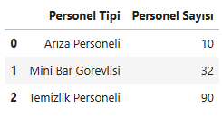
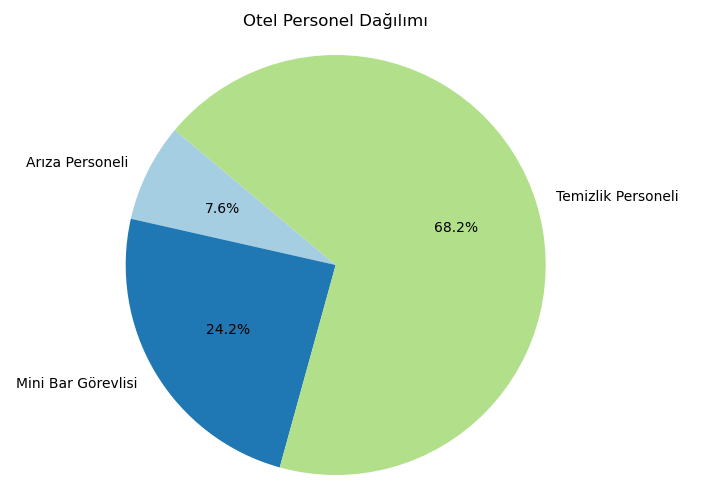
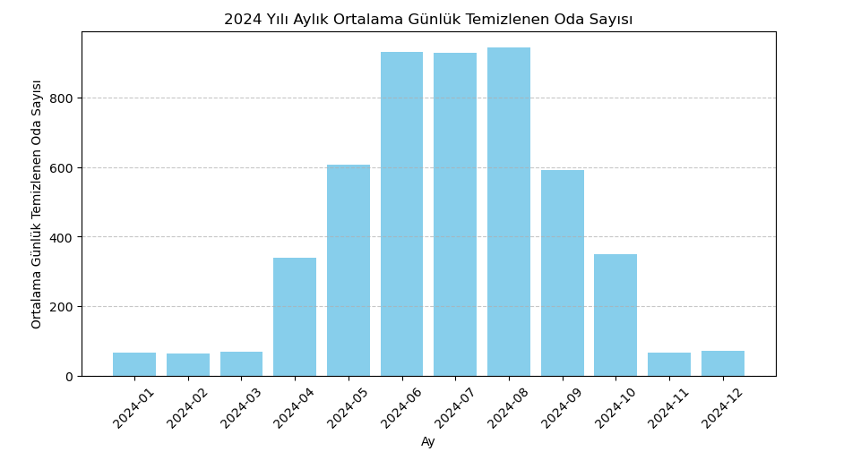

# 🧹 Otel Temizlik Operasyonları – Simülasyon Tabanlı Veri Projesi

## 📌 Genel Bakış

Bu proje, büyük ölçekli bir otelin günlük temizlik operasyonlarını yansıtan **simülasyon tabanlı bir veri seti oluşturmayı ve analiz etmeyi** amaçlamaktadır. Python kullanılarak üretilen bu sentetik veri seti, gerçek hayattaki operasyonel dinamiklere benzer şekilde yapılandırılmıştır:

- Mevsimsel doluluk oranları  
- Farklı oda tipleri (Standart, Suit, Lüx Suit)  
- Temizlik türleri (Rutin, Detaylı, Mini Bar, Arıza)  
- Temizlik süreleri ve personel atamaları  
- Giriş/çıkış saatleri ve çakışma önleyici zamanlama mantığı

Amaç, bu veriyi analiz ederek otel operasyonlarına dair anlamlı içgörüler üretmek ve karar destek süreçlerine katkı sağlayacak çıkarımlarda bulunmaktır.

## 📊 Proje Aşamaları

### ✅ 1. Veri Üretimi (Tamamlandı)
- 2024 yılı boyunca 365 günlük simülasyon  
- 18 katlı bir otel yapısı ve yüzlerce oda  
- Personel ataması ve görev planlaması  
- CSV ve Excel formatında dışa aktarım

### 🔄 2. Keşifsel Veri Analizi (Devam Ediyor)
Planlanan analiz başlıkları:
- Temizlik süresi dağılımları (oda ve görev tipine göre)  
- Personel iş yükü ve performans karşılaştırmaları  
- Günlük / aylık / mevsimsel yoğunluk görselleştirmeleri  
- Aykırı durumların ve verimsizliklerin tespiti  
- Zamanlama ve kaynak kullanımı için öneriler

## 📁 Dosyalar

| Dosya | Açıklama |
|-------|----------|
| `otel_veri_seti_(rev.06).ipynb` | Veri setini oluşturan Python Jupyter defteri |
| `otel_temizlik_veriseti_YYYY-MM-DD.csv` | Simülasyonun ürettiği veri seti (CSV) |
| `otel_temizlik_veriseti_YYYY-MM-DD.xlsx` | Aynı veri setinin Excel versiyonu |
| `otel_veri_analizi_(rev.02).ipynb` | Keşifsel veri analizine başlanan defter |
| `README.md` | Proje açıklamaları ve kullanım yönergeleri (bu dosya) |

## 🛠️ Kullanılan Teknolojiler

- Python  
- Pandas  
- NumPy  
- Jupyter Notebook  
- Matplotlib / Seaborn (analiz aşamasında)

## 🚀 Nasıl Çalıştırılır?

1. Bu repoyu klonlayın  
2. `otel_veri_seti_(rev.06).ipynb` dosyasını Jupyter Notebook’ta açın  
3. Tüm hücreleri çalıştırarak veri setini oluşturun  
4. Oluşan `.csv` veya `.xlsx` dosyalarını analiz için kullanabilirsiniz

## 📊 Örnek Görselleştirmeler

### 🔸 Personel Sayısı Tablosu

### 🔸 Personel Dağılımı

### 🔸 Aylık Ortalama Temizlenen Oda Sayısı (2024)

