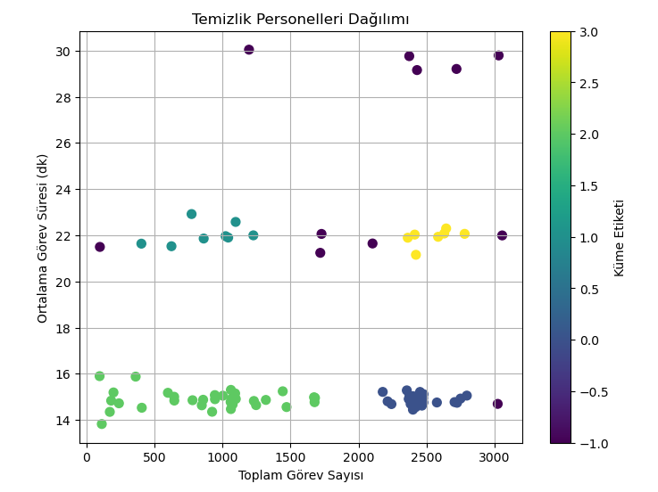
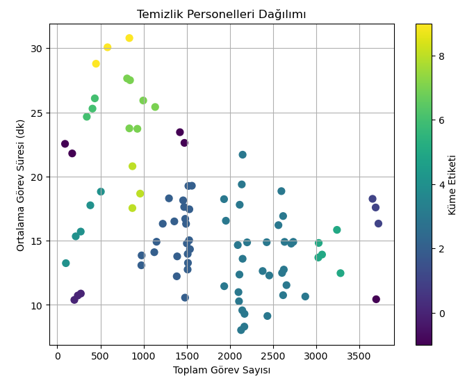
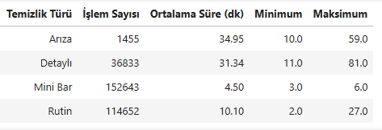

# 🧹 Otel Temizlik Operasyonları – Simülasyon ve Verimlilik Analizi Projesi

## 🌟 Genel Bakış

Bu proje, büyük ölçekli bir otelin **günlük temizlik operasyonlarını simüle ederek** gerçekçi bir veri seti oluşturmayı ve bu veri üzerinden **çalışan verimliliğini analiz etmeyi** hedeflemektedir.  
Python ile geliştirilen simülasyon, otel operasyonlarının günlük döngüsünü detaylı biçimde taklit ederken; analiz bölümü, **çalışan performansı, hız ve iş yükü** gibi metriklerle **veriye dayalı karar desteği** sağlamaktadır.

---

## 🏗️ Proje Aşamaları

### 1. Veri Seti Üretimi ✅
- 2024 yılı boyunca 365 gün simülasyon
- 18 katlı otel – farklı oda tipleri (Standart, Suit, Lüx Suit)
- Temizlik türleri (Rutin, Detaylı, Mini Bar, Arıza, vb.)
- Çalışan atamaları, zamanlama çakışmalarını önleyen yapı
- Giriş/çıkış saatleri ve temizlik süre simülasyonu
- `.csv` ve `.xlsx` formatlarında dışa aktarım

### 2. Keşifsel Veri Analizi ✅
- Oda tipi ve temizlik türüne göre süre analizleri  
- Personel iş yükü ve günlük çalışma takibi  
- Mevsimsel yoğunluk dağılımları  
- Aykırı değer tespiti ve süre kalibrasyonu

### 3. Verimlilik ve Performans Değerlendirme ✅
- Temizlik süre karşılaştırmalı **hız skoru**  
- Toplam iş yüküne göre **yoğunluk skoru**  
- Bu iki skorun ağırlıklı ortalamasıyla **genel verimlilik skoru**  
- Gerçek süreler üzerinden **otomatik norm belirleme** (data-driven kalibrasyon)  
- Aykırı personellerin dışlanması için **trimmed mean uygulaması**

### 4. Streamlit Arayüzü ✅
- Web tabanlı kullanıcı arayüzü
- Veri dosyası yükleme adımı
- Personel ID ve tarih aralığına göre filtreleme
- Anlık verimlilik, hız ve yoğunluk analizi
- Renkli ilerleme çubuğu ile görsel gösterim

---

## 🧠 Veri Seti Üretim Yaklaşımı (Simülasyon Mantığı)

Veri seti, gerçek dünyadaki temizlik operasyonlarını taklit eden bir simülasyon mantığı ile oluşturulmuştur. Aşağıdaki özellikler dikkate alınmıştır:

- **Kat ve oda yapısı**: 18 katlı otel, farklı büyüklükte ve tipte odalarla modellenmiştir.
- **Temizlik türleri**: Rutin, detaylı, minibar kontrolü ve teknik arıza gibi operasyonel türler dahil edilmiştir.
- **Personel atamaları**: Aynı anda birden fazla temizlik yapılmaması için zaman çakışmaları önlenmiştir.
- **Süre simülasyonu**: Temizlik süreleri, her temizlik türü ve oda tipi kombinasyonu için belirlenmiş normal dağılımlardan rastgele çekilmiştir.

| Dağıtımsız Süre Üretimi | Normal Dağılım Kullanılmış Hali |
|-------------------------|----------------------------------|
|  |  |

---

## 🔍 Veri Analiz Süreci

### 📊 1. Keşifsel Veri Analizi (EDA)
- Temizlik türüne ve oda tipine göre süre dağılımları
- Personel bazlı iş yükü ve ortalama görev süresi
- Zaman serisi ile mevsimsel analiz:
  
  

- Ortalama temizlik süreleri:
  
  

### 🧮 2. Verimlilik Skoru Hesaplamaları

- **Beklenen Süre**: Her temizlik türü ve oda tipi için veri setinden çıkarılır
- **Hız Skoru** = `(beklenen_süre / gerçek_süre) * 100`
- **Yoğunluk Skoru** = `(personelin görev sayısı / trimmed mean) * 100`
- **Verimlilik Skoru** = `(hız * 0.3 + yoğunluk * 0.7)`
- **Trimmed mean**: Alt %35 ve üst %5 personel dışlanarak hesaplanır

### 🧠 3. Kümeleme Analizi

- Çalışanlar, görev sayısı ve ortalama süreye göre gruplandırılır.
  
  

---

## 📁 Dosya Açıklamaları

| Dosya | Açıklama |
|-------|----------|
| `otel_veri_seti_rev.09.py` | Simülasyon kodu – veri üretimi |
| `otel_temizlik_veriseti_YYYY-MM-DD.csv` | Oluşturulan veri seti |
| `otel_veri_analizi_rev.03.ipynb` | Keşifsel analiz defteri |
| `personel_analiz_app.py` | Streamlit ile analiz arayüzü |
| `README.md` | Bu dokümantasyon dosyası |

---

## 🚀 Uygulama Nasıl Başlatılır?

### 1. Gerekli Kütüphaneleri Yükleyin:

```bash
pip install streamlit pandas openpyxl


